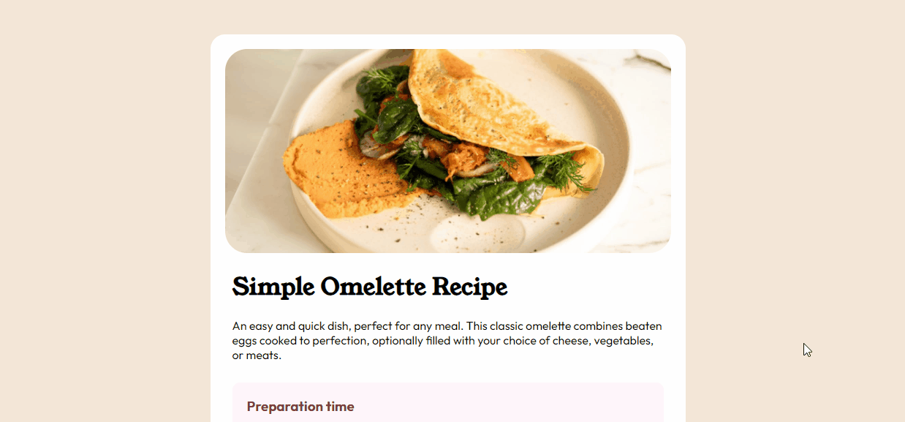

# Frontend Mentor - Recipe page

Esta é uma solução para o [desafio da página de receitas no Frontend Mentor](https://www.frontendmentor.io/challenges/recipe-page-KiTsR8QQKm). O desafio é focado para desenvolver a aprimorar o conhecimento em HTML e CSS, sendo um pouco mais exigente no seu conhecimento de CSS.

## Menu

  - [Screenshot](#screenshot)
  - [Links](#links)
  - [Feito com](#feito-com)
  - [o que aprendi](#o-que-aprendi)
- [Autor](#autor)
- [Contato](#contato)

### Screenshot

### Links

- Site da minha solução URL: [link do meu desafio](https://bruno-nog.github.io/simple-omelette-recipe/)

### Feito com

- HTML5
- CSS3
- Flexbox

### O que aprendi

Como o desafio prioriza e tem um foco no CSS, há algumas funções e estilizações específicas que utilizei e pratiquei no projeto, o HTML foi bem simples, algumas tags específicas que geralmente não é utilizada. Foi um desafio completo em HTML e CSS, e pode ser improvido com JS no futuro 

## Autor

- Frontend Mentor - [@Bruno-nog](https://www.frontendmentor.io/profile/Bruno-nog)

## Contato

